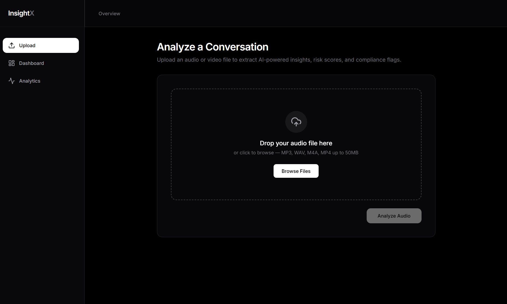
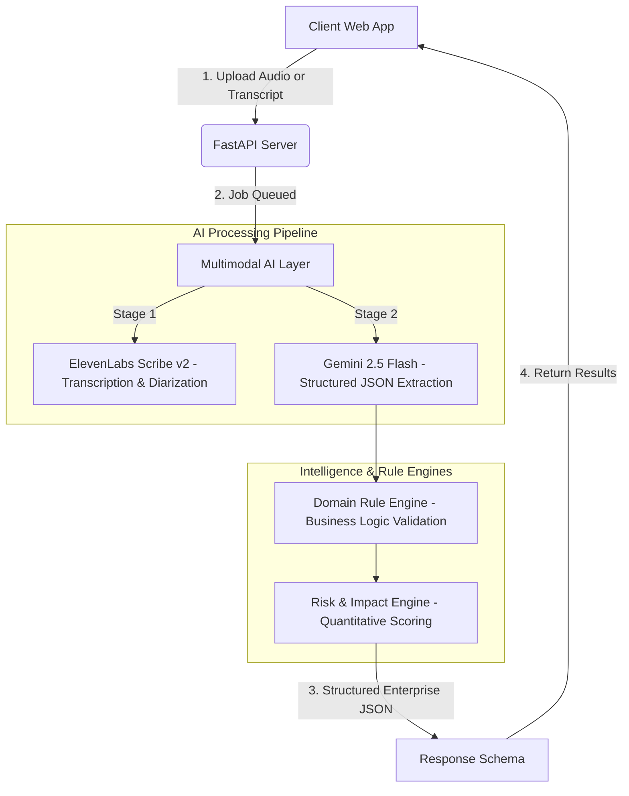

# 🌌 InsightX

InsightX is an **enterprise-ready, context-aware multimodal conversation intelligence API** designed to analyze customer conversations (voice or text). By leveraging advanced AI models and deterministic rule engines, InsightX generates structured intelligence including conversation summaries, sentiment analysis, intent detection, compliance risk scoring, escalation probability, and agent performance metrics.

⭐ **If you find InsightX useful, please consider giving us a star on GitHub! Your support helps us continue to innovate and deliver exciting features.**


[](https://github.com/AbhijithPM507/team-insight/issues)
[](https://github.com/AbhijithPM507/team-insight/stargazers)


[](https://github.com/AbhijithPM507/team-insight)

<p align="center">
    
</p>

## All features

- **Visual Dashboard:** Upload audio/video or text transcripts and view real-time intelligence breakdowns.
- **Multimodal AI Processing:** Powered by ElevenLabs Scribe v2 for high-quality speaker diarization and transcription.
- **Advanced Language Model:** Built on Gemini 2.5 Flash for complex structured JSON extraction, intent detection, and behavioral analysis.
- **Domain Rule Engine:** Custom logic configurable for specific business domains such as banking, telecom, insurance, and customer support.
- **Risk & Impact Engine:** Calculates quantitative compliance risk scores, churn risks, and escalation probabilities.
- **Explainable Output:** AI insights are post-processed by a deterministic rule engine to guarantee robust, explainable outcomes.
- **Unified Output Schema:** Emits structured enterprise-ready JSON encompassing domains, sentiment, topics, and agent performance.

<hr>

## Quickstart
The easiest way to get started with InsightX is by visiting the hosted live environment:
🌐 **Live Demo**: [https://insight.abhijith-project.me/](https://insight.abhijith-project.me/)

### Local Testing with Docker
You can easily build and run InsightX locally:

```bash
# Build the unified image
docker build -t insightx .

# Run the container locally
docker run \
  --name insightx \
  --restart unless-stopped \
  -p 8000:8000 \
  -p 5173:5173 \
  insightx
```

Once running, access the frontend web client or the backend Swagger API Docs.

---

## Architecture

InsightX uses a decoupled **React frontend client + FastAPI server** architecture.



### AI Pipeline & Architecture Details
*   **FastAPI Backend (`routes.py`)**: Handles `multipart/form-data` uploads (audio/video or text) and orchestrates processing.
*   **Audio Processing (`ai_service.py`)**: Uses **ElevenLabs Scribe v2** for advanced speaker diarization to separate customer vs. agent conversations.
*   **Language Model (`ai_service.py`)**: Uses **Gemini 2.5 Flash** for deep natural language understanding, entity extraction, and sentiment mapping.
*   **Rule & Risk Engines (`rule_engine.py`, `risk_engine.py`)**: Layers deterministic logic and risk metrics (e.g. churn, compliance flags) on top of the raw AI output, ensuring business compliance.

---

## Documentation
- [API Documentation](API_DOCUMENTATION.md)<br>

## Self-hosted

You can use the hosted platform or self-host InsightX in your own enterprise environment.

### Manual Installation and Setup

#### Prerequisites
1.  **Python**: 3.11 or higher installed.
2.  **Node.js**: v18.0.0 or higher.
3.  **API Keys**: You will need valid keys for Google Gemini and ElevenLabs.

#### 1. Start the Backend API Server
Navigate to the project root directory:

```powershell
# Create a virtual environment
python -m venv venv

# Activate the virtual environment
# Windows (PowerShell):
.\venv\Scripts\Activate.ps1
# macOS/Linux:
source venv/bin/activate

# Install dependencies
pip install -r requirements.txt

# Configure Environment Variables
# Create a file named .env and add:
# GEMINI_API_KEY=your_gemini_api_key
# ELEVENLABS_API_KEY=your_elevenlabs_api_key

# Run the FastAPI server with reload enabled
uvicorn app.main:app --reload --port 8000
```
The backend API documentation (Swagger UI) will be available at [http://127.0.0.1:8000/docs](http://127.0.0.1:8000/docs). Here you can directly upload audio files or transcripts to test the endpoints.

#### 2. Start the Frontend Client
Navigate to the `frontend` directory in a new terminal window:

```bash
# Enter the frontend folder
cd frontend

# Install Node modules
npm install

# Start the Vite development server
npm run dev
```
Open your browser and navigate to [http://localhost:5173/](http://localhost:5173/).

---

## Branching model
We use the git-flow branching model. The base branch is `develop`. Stable versions are tagged and released on the `main` branch.

## Contributing
Kindly open an issue or start a pull request on GitHub to suggest bug fixes, custom scripts, or additional features.

## Contributors
<a href="https://github.com/AbhijithPM507/team-insight/graphs/contributors">
  
</a>

## License
InsightX © 2026 - Released under the MIT License.